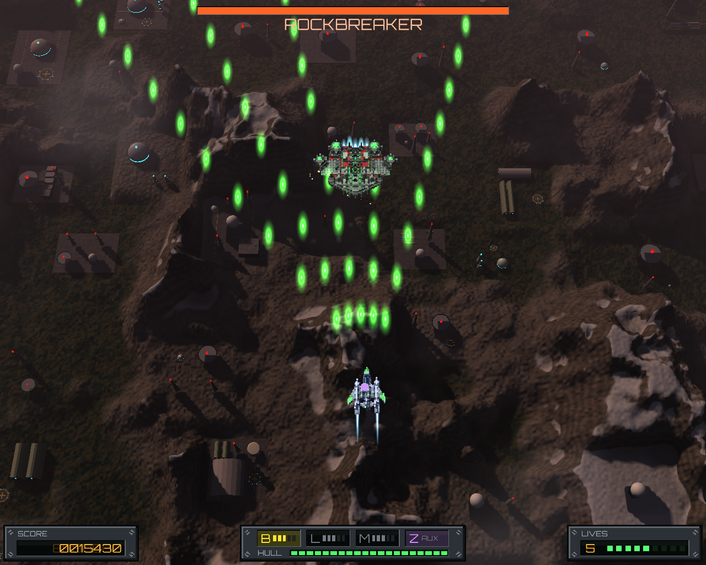
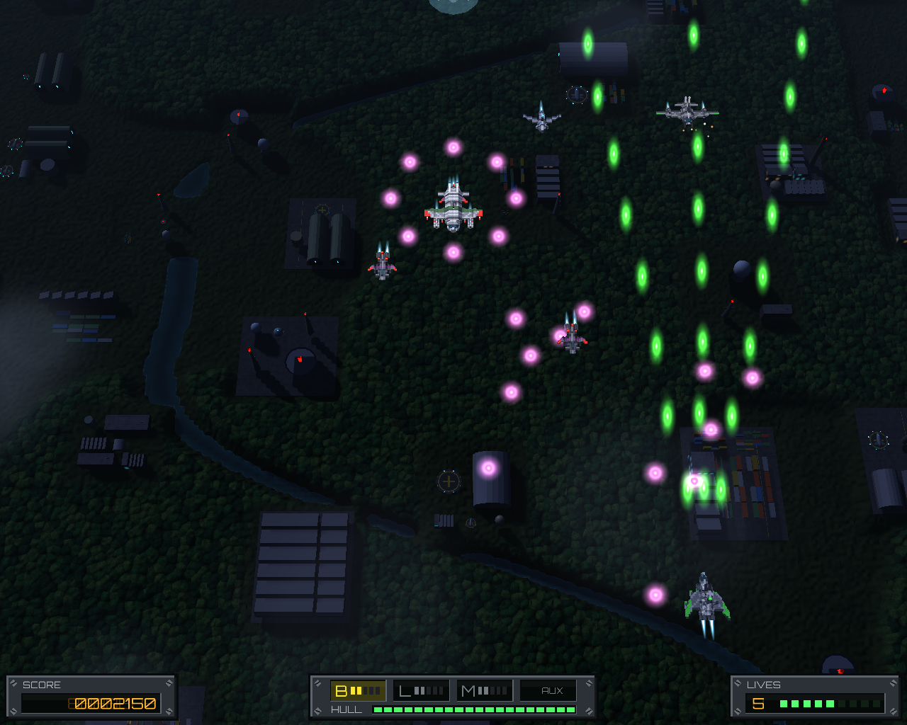
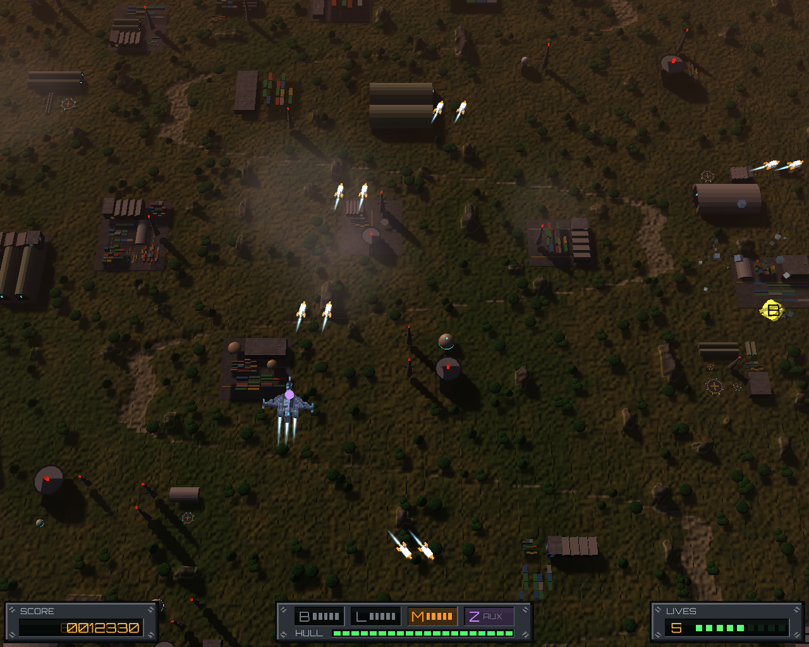
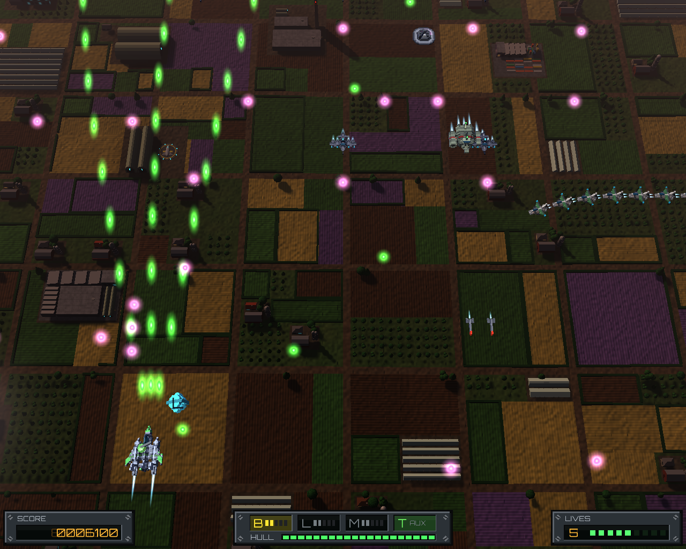
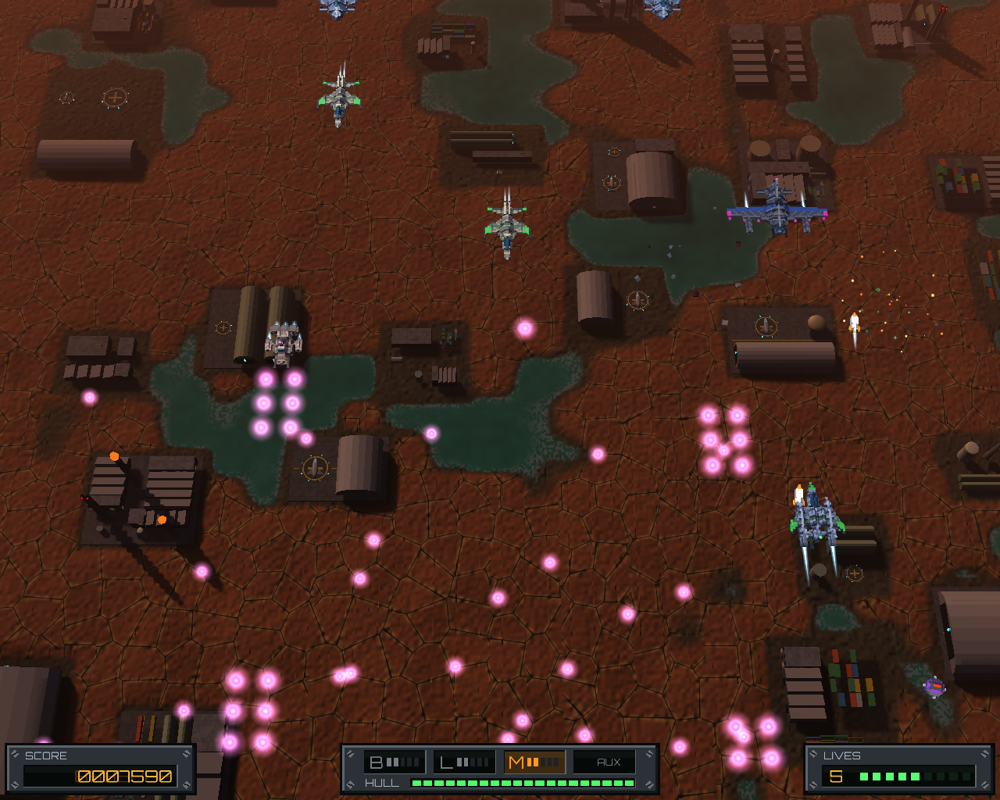
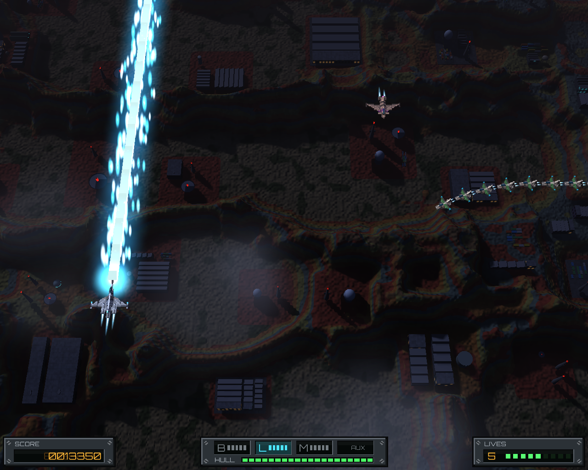
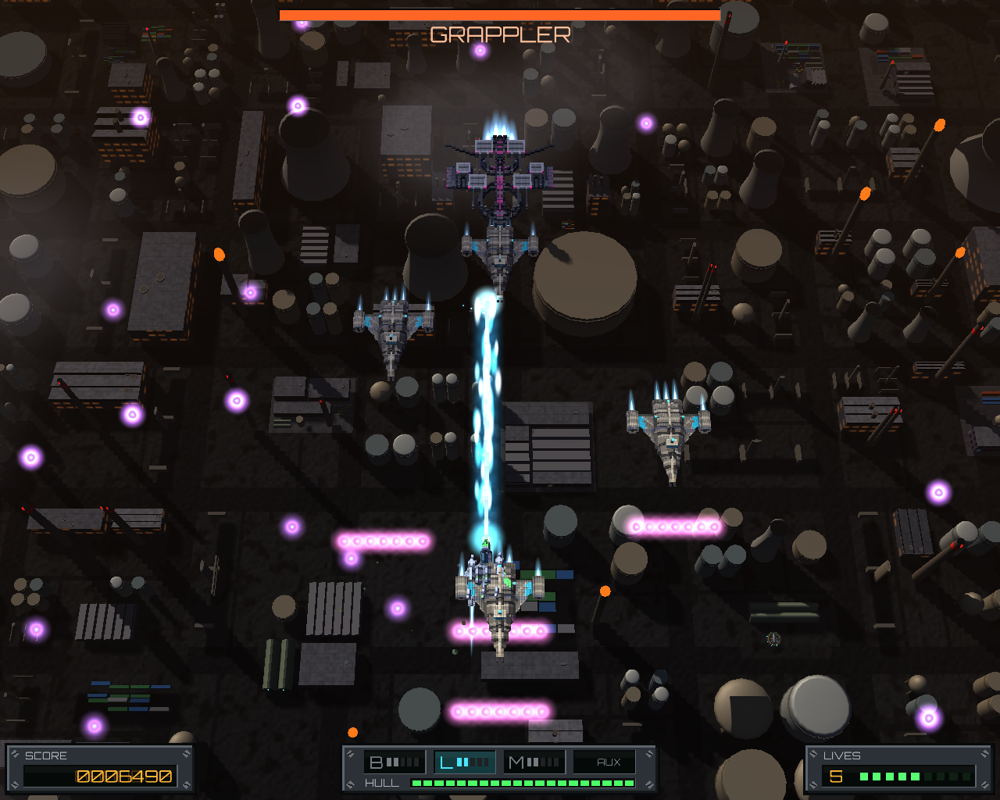
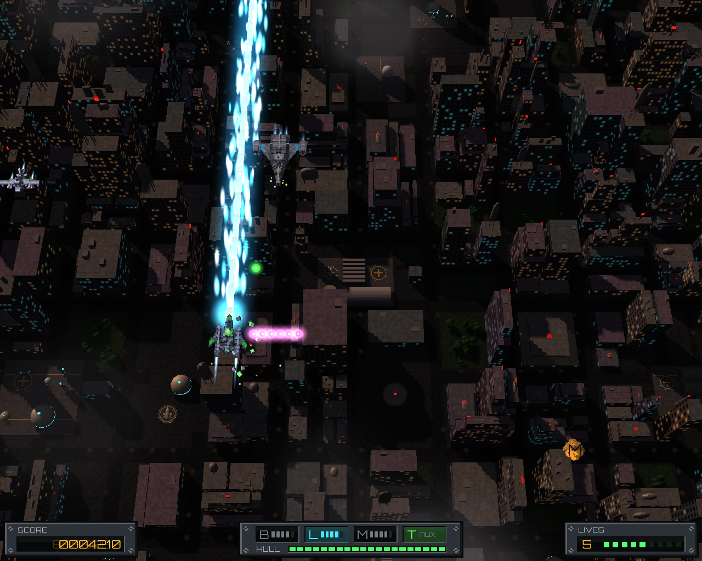

# pewpy

[](https://github.com/rguillon/pewpy/actions/workflows/main.yml?query=branch%3Amain)
[](https://codecov.io/gh/rguillon/pewpy)
[](https://img.shields.io/github/commit-activity/m/rguillon/pewpy)
[](https://img.shields.io/github/license/rguillon/pewpy)

A vertical-scrolling shoot 'em up written in Python with [Panda3D](https://www.panda3d.org/).

This project is just me trying vibe coding, do not expect quality.

Nothing is done manually (so far), the levels, ships and even the music are all generated with Claude Code.

You fly a ship over scrolling landscapes and shoot down waves of enemy aircraft, ground turrets and bosses. The
ships and enemies are voxel models built in code, and the ground is painted live by shaders; a tilted 3D camera
gives the flat, arcade-style gameplay some depth.

- **8 worlds of 6 levels each**, from the Highlands to the Metropolis, every level a little harder than the last.
  Each level has a mini boss halfway and a bigger final boss at the end.
- **3 ships** to choose from: the balanced Vanguard, the armored Juggernaut and the fast, self-repairing Phantom.
- **3 weapons**, switched at any time: spreading bullets, a continuous laser and homing missiles, each upgraded
  up to level 5 by the capsules enemies drop. Some drops also add a secondary weapon (a turret or a lightning gun)
  that fires on its own.
- Synthwave music, generated, and an AI player that learns to play the levels, to watch from the Dev menu.

## Screenshots

|                                                                 |                                                                 |
| :-------------------------------------------------------------: | :-------------------------------------------------------------: |
|    **1. Highlands**   |     **2. Wildwood**    |
|     **3. Lush Veld**    |    **4. Heartland**   |
|  **5. Rust Pan** |  **6. Bright Ridges** |
|    **7. Ironworks**   |   **8. Metropolis**  |

## Playing

You need [uv](https://docs.astral.sh/uv/) and Python 3.12 or newer.

```bash
uv run python -m pewpy
```

| Action        | Key                                                 |
| ------------- | --------------------------------------------------- |
| Move          | arrows                                              |
| Fire          | space (hold it to keep firing)                      |
| Switch weapon | shift (bullets → laser → missiles)                  |
| Pause         | escape                                              |
| Menus         | up/down to move, enter to choose, escape to go back |

## Developing

The game design lives in [`docs/specs/`](docs/specs/), and the milestones in
[`docs/specs/roadmap.md`](docs/specs/roadmap.md).

- `make check`: lint and type-check; `make test`: run the tests.
- Main menu > Dev (in `make run` too): browse the player's ships, the enemies and the bosses; Left/Right pick a
  model, Up/Down its size, Space makes a new one of that size, Enter saves it in place of the model. Music browses
  the songs the same way: Left/Right pick one (it plays), Space composes a new one, Enter saves it.
- Main menu > Dev > AI playing: pick a ship and a level, then watch the AI play them (it learns with `make learn`).
- Main menu > Dev > Screenshots: pick a world, Space plays one of its levels to a moment drawn at random, Enter
  saves that as the world's screenshot above.
- `make help`: every other tool (levels, the AI...).

- **Github repository**: <https://github.com/rguillon/pewpy/>

---

Repository initiated with [osprey-oss/cookiecutter-uv](https://github.com/osprey-oss/cookiecutter-uv).
